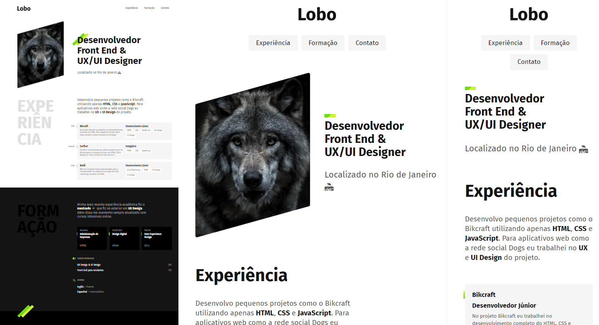

# Página de Currículo (Curso de HTML e CSS Origamid 🐺)

Este projeto foi criado com o objetivo de colocar em prática os conhecimentos adquiridos sobre semântica, boas práticas e outros conceitos desenvolvidos ao decorrer do curso. Utilizei conceitos de flexbox, grid, e responsividade.


## Screenshots 📷

Resultado da página / responsividade:




## Stack utilizada 🔧

**Front-end:** HTML e CSS


## Rodando localmente 💡

Clone o projeto

```bash
  git clone https://link-para-o-projeto
```

Entre no diretório do projeto

```bash
  cd my-project
```

Instale as dependências

```bash
  npm install
```

Inicie o servidor

```bash
  npm run start
```


## Licença

Direitos Reservados a Origamid. 🐺
